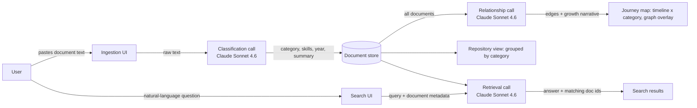

# MemoryVerse — AI Digital Identity System

An AI-powered system that turns a person's scattered certificates, resumes, project reports, and internship letters into one structured, searchable identity — instead of another folder to lose things in.

Built for the **MemoryVerse AI '26** hackathon (Wooble).

## The problem

Students accumulate proof of their own growth — certificates, resumes, reports, portfolios — across drives, emails, and devices. Cloud storage can hold the files. It can't tell you what they mean, how they connect, or what they add up to. MemoryVerse is built to do that last part.

## What it does

| Module | Brief requirement | Implementation |
|---|---|---|
| 1. AI data ingestion | Upload certificates, resumes, reports, letters | Paste-in ingestion pane; designed to extend to file upload with OCR/text extraction |
| 2. Intelligent categorization | Auto-classify into Projects, Skills, Certifications, Internships, Achievements, Academics | Live call to Claude (`claude-sonnet-4-6`) returns structured JSON classification per document — no manual tagging |
| 3. Relationship engine | Connect certification → skill → project → internship → career path | A second Claude call reasons over the *entire* document set at once and returns a graph of edges with human-readable relationship labels |
| 4. Digital journey timeline | Visual growth over time | The "Journey map" plots every document by year (x-axis) and category (y-axis), with the relationship graph overlaid as connecting threads — timeline and connections in a single view |
| 5. Smart retrieval | "Show all my certificates", "show my AI projects" | A third Claude call does query-time semantic retrieval over the document metadata and returns the matching documents plus a direct answer |

## Why this counts as AI, not just storage

Traditional systems need a human to pick folders and tags. Here, every organizing decision — category, extracted skills, cross-document relationships, and search relevance — is made by an LLM reasoning over the content itself, not by keyword rules or a fixed taxonomy someone hand-coded. That's what makes the repository *understand* a journey instead of just hosting files.

## Architecture



Every "call" box above is a live request to the Anthropic Messages API made directly from the client, with the model asked to return structured JSON only — the same pattern used for classification, relationship extraction, and retrieval. No separate backend is required for the prototype; a production build would move these calls behind a thin API layer and persist `STORE` in a real database.

## Tech stack

- **Reasoning layer:** Claude Sonnet 4.6 for classification, relationship extraction, and retrieval — used as a general-purpose semantic engine instead of hand-built NLP pipelines or keyword search.
- **Frontend:** React, single-page prototype.
- **Data model:** each document is `{ id, title, category, year, skills[], summary, organization }` — small enough to pass whole documents-list context to the model on every relationship/search call, at the current prototype scale.

## Where this goes next (roadmap)

The brief calls out embeddings, vector databases, and RAG as things reviewers will look for. The current prototype gets categorization, relationships, and retrieval entirely through Claude's reasoning over structured summaries, which works well at small scale and is transparent to explain. The natural next step for scale:

1. **Embeddings + vector DB** (e.g. pgvector, Pinecone, or Weaviate) — embed each document's extracted text so retrieval stops re-sending full metadata on every query and instead does approximate nearest-neighbour search first, with Claude used to rerank and answer.
2. **Real file ingestion** — PDF/image OCR pipeline so certificates and scanned letters can be dropped in directly, not pasted as text.
3. **Persistent storage** — move the in-memory document store to a real database per user, with original files kept alongside extracted metadata so "original format" access (a brief requirement) is guaranteed.
4. **Incremental relationship updates** — instead of recomputing the full graph on every new document, diff and update only the affected edges.

## Thought process

The brief's success metric is a student saying *"I never have to search through folders again."* That pointed at two design choices:

- **One view that shows both time and connection.** Reviewers get "Module 4: timeline" and "Module 3: relationships" as separate asks, but a student experiences their own growth as one continuous thing — a cert *led to* a project *led to* an internship, and all of that happened *over time*. Splitting them into two screens would have hidden that story. The journey map does both: x-axis is time, y-axis is category, and the gold threads are the AI-found relationships between them.
- **Classification and connections should be visibly AI, not a black box.** Every document shown in the demo has been through a live Claude call, not a seeded label — so a reviewer can paste in their own certificate mid-demo and watch it get correctly filed and connected in real time.

## Repo structure

```
memoryverse-ai/
├── README.md
├── src/
│   └── App.jsx              # the prototype — single-file React component
├── docs/
│   ├── architecture-diagram.svg
│   └── thought-process-sheet.docx
└── assets/
    └── cover-image.png      # submission cover image
```

## Running it

The prototype is a single-file React component (`src/App.jsx`) that calls the Anthropic API directly from the client. Drop it into any React environment with network access to `api.anthropic.com`, or open it as a Claude.ai artifact where the API call is already authenticated.
